<div align="center">
  
# 👋 Hi there, I'm Sachin Tarkar!


</div>

---

## 🚀 About Me


- 📱 **iOS App Developer** & **UI/UX Designer** passionate about creating stunning mobile experiences
- 🎨 I bridge the gap between **beautiful design** and **functional code**
- 🔭 Currently crafting innovative iOS applications with pixel-perfect designs
- 🌱 Always exploring the latest in **iOS development** and **design trends**
- 👯 Looking to collaborate on **iOS projects** and **design systems**
- 💬 Ask me about **Swift, SwiftUI, Figma, iOS Design Patterns**
- 📫 Reach me at: **sachintarkar842@gmail.com**
- ⚡ Fun fact: I design in Figma and bring it to life in Xcode! 🎨📱

---

## 🛠️ Tech Stack & Design Tools

<div align="center">

### 📱 iOS Development


### 🎨 Design & Prototyping


### 🏗️ Architecture & Patterns


### 🌐 Additional Skills


</div>

---

## 📊 GitHub Stats

<div align="center">
  


</div>

<div align="center">
  


</div>

---

## 🏆 GitHub Trophies

<div align="center">
  


</div>

---

## 🎨 Design + Development Philosophy

<div align="center">

```swift
struct DesignerDeveloper {
    let name = "Sachin Tarkar"
    let roles = ["iOS App Developer", "UI/UX Designer"]
    
    // Development Skills
    let programmingLanguages = ["Swift", "SwiftUI", "UIKit"]
    let frameworks = ["Combine", "Core Data", "Foundation"]
    let tools = ["Xcode", "Instruments", "TestFlight"]
    
    // Design Skills  
    let designTools = ["Figma", "Sketch", "Adobe XD", "Principle"]
    let designSkills = ["User Research", "Wireframing", "Prototyping", "Design Systems"]
    let specialties = ["Mobile UI Design", "iOS Human Interface Guidelines"]
    
    func myApproach() -> String {
        return """
        🎨 Design with user experience in mind
        📱 Develop with performance and accessibility
        ✨ Bridge design and code seamlessly
        🚀 Create apps that users love
        """
    }
    
    func workflow() -> [String] {
        return [
            "Research & User Analysis",
            "Wireframe & Prototype in Figma",
            "Design System Creation", 
            "SwiftUI Implementation",
            "User Testing & Iteration"
        ]
    }
}

let creator = DesignerDeveloper()
print(creator.myApproach())
```

</div>

---

## 🎯 Skills & Expertise

<div align="center">

| 📱 **iOS Development** | 🎨 **UI/UX Design** | 🔧 **Tools & Tech** |
|----------------------|-------------------|-------------------|
| Swift Programming | User Research | Figma |
| SwiftUI Framework | Wireframing | Xcode |
| UIKit Development | Prototyping | Git & GitHub |
| iOS Architecture | Design Systems | App Store Connect |
| Core Data | User Testing | TestFlight |
| Combine Framework | Interaction Design | Firebase |
| Performance Optimization | Accessibility Design | REST APIs |
| App Store Guidelines | iOS Design Patterns | CI/CD |

</div>

---

## 🚀 My Design-to-Code Process

```mermaid
graph TD
    A[🔍 User Research] --> B[📝 Wireframing]
    B --> C[🎨 UI Design in Figma]
    C --> D[🔧 Prototype & Test]
    D --> E[📱 SwiftUI Implementation]
    E --> F[🧪 User Testing]
    F --> G[🚀 App Store Release]
    F --> D
```

<div align="center">



</div>

---

## 🌟 What Makes Me Unique

<div align="center">

### 🎨 **Designer's Eye** + 📱 **Developer's Mind**

| Design Thinking | Development Excellence |
|----------------|----------------------|
| 👥 User-Centered Design | 🏗️ Clean Architecture |
| 🎯 Problem Solving | ⚡ Performance Optimization |
| 🎨 Visual Aesthetics | 🧪 Test-Driven Development |
| 📊 Data-Driven Decisions | 📱 iOS Best Practices |
| ♿ Accessibility Focus | 🔒 Security Implementation |

</div>

---

## 🐍 Contribution Snake

<div align="center">
  


</div>

---

## 📈 Activity Graph

<div align="center">
  


</div>

---

## 🎨 Design Portfolio Highlights

<div align="center">

### 🔥 Featured Work
```
📱 iOS App Designs: Beautiful, intuitive mobile interfaces
🎨 Design Systems: Consistent, scalable design components  
🚀 Prototypes: Interactive demos that wow clients
✨ UI Animations: Smooth, delightful user interactions
```

### 🏆 Design Principles I Follow
- **Simplicity** - Less is more, focus on what matters
- **Consistency** - Unified experience across the app
- **Accessibility** - Design for everyone, not just some
- **Performance** - Beautiful designs that perform well

</div>

---

## 🌐 Connect with Me

<div align="center">

<a href="https://linkedin.com/in/sachintarkar842">
  
</a>
<a href="https://dribbble.com/sachintarkar842">
  
</a>
<a href="https://behance.net/sachintarkar842">
  
</a>
<a href="mailto:sachintarkar842@gmail.com">
  
</a>
<a href="https://twitter.com/sachintarkar842">
  
</a>

</div>

---

## 💖 Support My Work

<div align="center">

<a href="https://www.buymeacoffee.com/sachintarkar">
  
</a>

</div>

---

<div align="center">
  
### 🎨 "Design is not just what it looks like and feels like. Design is how it works." – Steve Jobs


</div>

---

<div align="center">
  
**Thanks for visiting my profile! Let's create something amazing together! 🚀🎨📱**

 <em><b>Always excited to collaborate with fellow designers and developers!</b> Whether you need a beautiful design or a robust iOS app, <b>let's bring ideas to life!</b> ✨</em>

</div>
